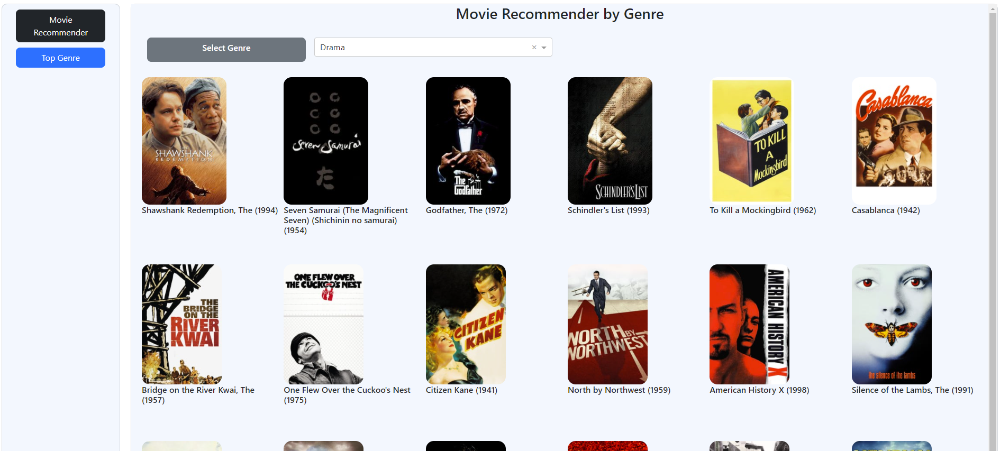

# About the app
> This app is built with a recommendation engine. Based on the user ratings, it recommends top movies using collaborative filtering technique. Users can also select their choice of genre to get top recommendation. Please refer to `Movie_Recommender.ipynb` file to know in details, how it is done.

> Following technologies are used to build app.
- Backend: Python, Django framework, Django plotly dash module
- Frontend: JavaScript, CSS, HTML
- Server: AWS EC2 Instance small

# How to use

### Step 1: Rate some movies
 

> 

### Step 2: Click on submit
 

> 

### Get Top Movies by Genre
 

> 